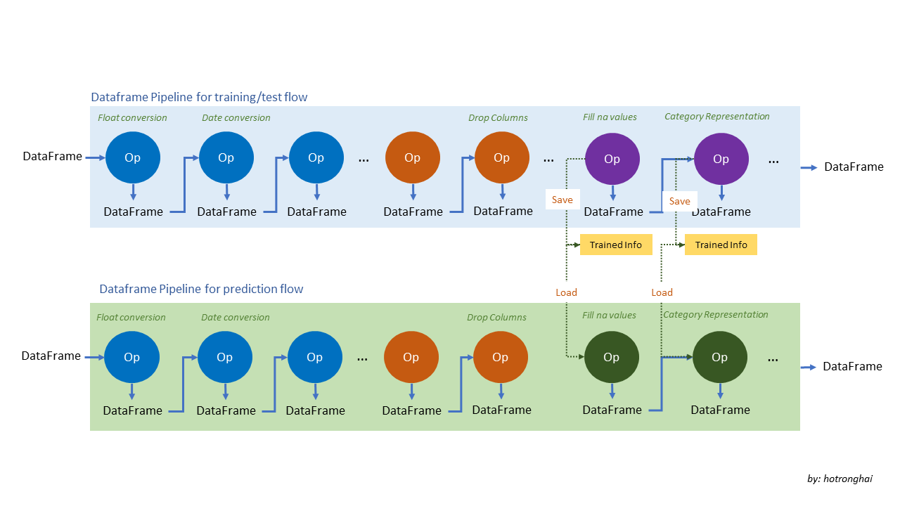
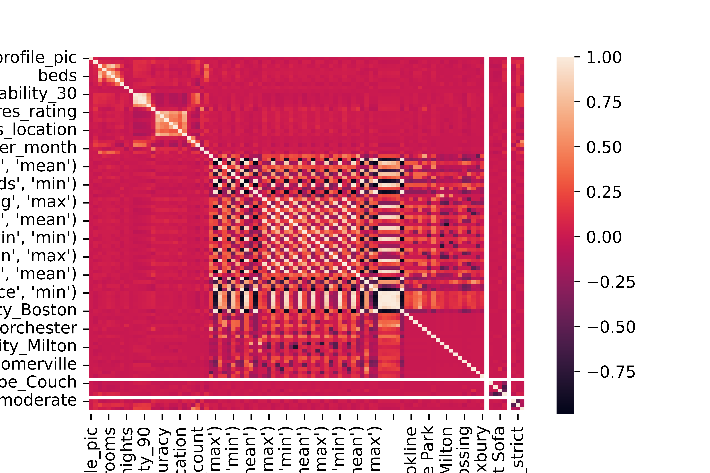

<div align="center">
  <h3 align="center">Do you want to save money when traveling to Boston?</h3>

  <p align="center">
    Self study for Boston Airbnb housing data.
    <br />
    <br />

  </p>
</div>

<!-- TABLE OF CONTENTS -->
<details>
  <summary>Table of Contents</summary>
  <ol>
    <li>
      <a href="#about-the-project">Business Understanding</a>

    

   <li><a href="#prepare-data">Prepare data</a></li>

   <li><a href="#question-1">Question 1: What are prices in cities in a specified timeframe?</a></li>
   <li><a href="#question-2">Question 2: What are the factors that impact prices?</a></li>
   <li><a href="#question-3">Question 3: How much the price for given house ?</a></li>

  </ol>
</details>


## Section 1: Business Understanding
I love to travel and usually when I have time and money, I pack my bags and hit the road. One of the issues affecting my travel budget is the cost of accommodation (hotel...). Recently, when I joined the program on Udacity, I got data about housing prices in Boston. Let's study housing prices in Boston with me. There are 3 questions that I am interested in when looking at this data:
- Question 1: What are prices in cities in a specified timeframe?
- Question 2: What are the factors that impact prices?
- Question 3: How much the price for given house ?

### Prerequisites
Housing price data is downloaded from Kaggle at the following link [Boston data on Kaggle](https://www.kaggle.com/datasets/airbnb/boston)


## Section 2: Data Understanding

In the Boston data, there are some files:
* `calendar.csv`: Calendar, including listing id and the price and availability for that day
* `listing.csv`: Listings, including full descriptions and average review score
* `reviews.csv`: Reviews, including a unique id for each reviewer and detailed comments

We take alook about Boston data.


### Gather data
We can display the data by looking at data frames the calendar, listing, and reviews

<br /><br />
*Calendar sample data*


| Index | listing_id |     date | available | price |
|-------|-----------:|---------:|----------:|------:|
|   0   | 12147973   | 9/5/2017 | f         | NaN   |
|   1   | 12147973   | 9/4/2017 | f         | NaN   |
|   2   | 12147973   | 9/3/2017 | f         | NaN   |
|   3   | 12147973   | 9/2/2017 | f         | NaN   |
|   4   | 12147973   | 9/1/2017 | f         | NaN   |

The prices will be `NaN` in the cases there is no available (value got `f`)

*Listing sample data*

| Index |       id |                           listing_url |   scrape_id | last_scraped |                                          name |                                            summary |                                               space |                                        description | experiences_offered |                               neighborhood_overview | ... | review_scores_value | requires_license | license | jurisdiction_names | instant_bookable | cancellation_policy | require_guest_profile_picture | require_guest_phone_verification | calculated_host_listings_count | reviews_per_month |
|-------|---------:|--------------------------------------:|------------:|-------------:|----------------------------------------------:|---------------------------------------------------:|----------------------------------------------------:|---------------------------------------------------:|--------------------:|----------------------------------------------------:|----:|--------------------:|-----------------:|--------:|-------------------:|-----------------:|--------------------:|------------------------------:|---------------------------------:|-------------------------------:|------------------:|
|   0   | 12147973 | https://www.airbnb.com/rooms/12147973 | 2.01609E+13 | 9/7/2016     | Sunny   Bungalow in the City                  | Cozy,   sunny, family home. Master bedroom high... | The   house has an open and cozy feel at the sam... | Cozy,   sunny, family home. Master bedroom high... | none                | Roslindale   is quiet, convenient and friendly. ... | ... | NaN                 | f                | NaN     | NaN                | f                | moderate            | f                             | f                                | 1                              | NaN               |
|   1   | 3075044  | https://www.airbnb.com/rooms/3075044  | 2.01609E+13 | 9/7/2016     | Charming room in pet friendly apt             | Charming and quiet room in a second floor 1910...  | Small but cozy and quite room with a full size...   | Charming and quiet room in a second floor 1910...  | none                | The room is in Roslindale, a diverse and prima...   | ... | 9                   | f                | NaN     | NaN                | t                | moderate            | f                             | f                                | 1                              | 1.3               |
|   2   | 6976     | https://www.airbnb.com/rooms/6976     | 2.01609E+13 | 9/7/2016     | Mexican Folk Art Haven in Boston              | Come stay with a friendly, middle-aged guy in ...  | Come stay with a friendly, middle-aged guy in ...   | Come stay with a friendly, middle-aged guy in ...  | none                | The LOCATION: Roslindale is a safe and diverse...   | ... | 10                  | f                | NaN     | NaN                | f                | moderate            | t                             | f                                | 1                              | 0.47              |
|   3   | 1436513  | https://www.airbnb.com/rooms/1436513  | 2.01609E+13 | 9/7/2016     | Spacious Sunny Bedroom Suite in Historic Home | Come experience the comforts of home away from...  | Most places you find in Boston are small howev...   | Come experience the comforts of home away from...  | none                | Roslindale is a lovely little neighborhood loc...   | ... | 10                  | f                | NaN     | NaN                | f                | moderate            | f                             | f                                | 1                              | 1                 |
|   4   | 7651065  | https://www.airbnb.com/rooms/7651065  | 2.01609E+13 | 9/7/2016     | Come Home to Boston                           | My comfy, clean and relaxing home is one block...  | Clean, attractive, private room, one block fro...   | My comfy, clean and relaxing home is one block...  | none                | I love the proximity to downtown, the neighbor...   | ... | 10                  | f                | NaN     | NaN                | f                | flexible            | f                             | f                                | 1                              | 2.25              |

In the data, we can see there are mixed values of text, numeric and boolean values. The listing data include information about all listings such as how many bedrooms, bedroom types and prices in normal cases
<br />
*Reviews sample data*

| Index | listing_id |      id |      date | reviewer_id | reviewer_name |                                            comments |
|-------|-----------:|--------:|----------:|------------:|--------------:|----------------------------------------------------:|
|   0   | 1178162    | 4724140 | 5/21/2013 | 4298113     | Olivier       | My   stay at islam's place was really cool! Good... |
|   1   | 1178162    | 4869189 | 5/29/2013 | 6452964     | Charlotte     | Great location for both airport and city - gre...   |
|   2   | 1178162    | 5003196 | 6/6/2013  | 6449554     | Sebastian     | We really enjoyed our stay at Islams house. Fr...   |
|   3   | 1178162    | 5150351 | 6/15/2013 | 2215611     | Marine        | The room was nice and clean and so were the co...   |
|   4   | 1178162    | 5171140 | 6/16/2013 | 6848427     | Andrew        | Great location. Just 5 mins walk from the Airp...   |


## Section 3: Prepare Data

### Create pipeline data conversion

Pipelines are built on top of operation nodes. The tasks of these operations (OpDataFrame) nodes will perform an operation on the data frame. Pipelines are combined into chains of these node operations to perform.

I will divide these node operations into the following  groups:
- Group handling simple operations: Those that handle data type conversion.
- Group data mapping processing: Processes to normalize records
- Group data structure change processing: in the process of manipulating data, we may have to change the structure of the dataframe such as drop columns, ..
- Group data processing group: operations such as fill null values or representation of column
categories as dummies (onehot). We will have 2 sets of data: training and prediction data. In the training data set, we have more complete information, and so the calculation of the data will be calculated on this training data set. In the prediction set, we will have less information, so we will use the calculated value available from the training set and apply it to the prediction set.


The overview model of the pipeline is as below:



We will make more detail in after sections

### Clean data types
There are some invalid data in both values and data types, we will clean up the data for analysis.

We will display the data type in calendar and listing data.

*Calendar data:*

| listing_id    | int64  |
|---------------|--------|
|      date     | object |
|   available   | object |
|     price     | object |


The data types of dataframe `df_cal` should be changed:
- `date`: object -> datetime
- `available`: object -> boolean
- `price`: object -> float

*Listing data types:*

| Colum                            | Type    |
|----------------------------------|---------|
| experiences_offered              | object  |
| neighborhood_overview            | object  |
| notes                            | object  |
| host_url                         | object  |
| host_name                        | object  |
| host_since                       | object  |
| host_location                    | object  |
| host_about                       | object  |
| host_response_time               | object  |
| host_response_rate               | object  |
| host_acceptance_rate             | object  |
| host_is_superhost                | object  |

There are so many columns having `object` datatype, we will build a pipeline to convert the data


We will create the calendar pipeline that convert data types of calendar dataframe.

Likewise I will create a pipeline that will convert the data types of the listing dataframe.


### Re-mapping city
As we can see in the city information, there are some inconsistent data, for example `Boston (Charlestown)`, `Jamaica Plain (Boston)`...
These values should be mapped with specified location (if any).

```
cleaned_df_listing['city'].value_counts()
```


| City                      | Count |
|---------------------------|-------|
| Boston                    | 3381  |
| Roxbury Crossing          | 24    |
| Somerville                | 19    |
| Brookline                 | 18    |
| Jamaica Plain             | 18    |
| Cambridge                 | 16    |
| Brighton                  | 15    |
| Charlestown               | 15    |
| Dorchester                | 15    |
| Allston                   | 12    |
| Roslindale                | 6     |
| West Roxbury              | 5     |
| ROXBURY CROSSING          | 4     |
| East Boston               | 3     |
| Mattapan                  | 3     |
| Jamaica Plain             | 2     |
| Boston, Massachusetts, US | 2     |
| Jamaica Plain, Boston     | 2     |
| South Boston              | 2     |
| Hyde Park                 | 2     |
| ALLSTON                   | 2     |
| Roslindale, Boston        | 1     |
| dorchester, boston        | 1     |
| Boston                    | 1     |
| Jamaica plain             | 1     |
| Jamaica Plain, MA         | 1     |
| Mission Hill, Boston      | 1     |
| Boston (Jamaica Plain)    | 1     |
| Newton                    | 1     |
| Milton                    | 1     |
| Watertown                 | 1     |
| Boston (Charlestown)      | 1     |
| east Boston               | 1     |
| Brighton                  | 1     |
| 波士顿                    | 1     |
| Jamaica Plain (Boston)    | 1     |
| boston                    | 1     |
| South End, Boston         | 1     |
| Name: city, dtype: int64  |       |

For convenience, I will add a node that maps this city's data into the pipeline


### Merge data to gather more information


Because now we have 2 data frames: `calendar` for the prices of listing by month, and `listing` is for detailed
information about the listing. We want to answer some questions such as what are the prices of cities for every month?
To do that we can merge 2 data frames to centralize one data frame.

I also added a node for this merge on a new pipeline. The merge will be performed on the cleaned data


### Add month information
In the calendar we can see that the housing price listing by date, I want to calculate prices by month.
To do that I will add new column `_month` to extract month information from `date`


## Section 4: Evaluation
Now from cleaned data, I will try to evaluate to answer 3 questions.

### Question 1: What are prices in cities in a specified timeframe?

I will do the calculation of the group by city and month (new added field) and calculate the mean value.
Since the listing prices are taken on a daily basis, for the convenience of monthly calculations, we will calculate the mean price by month.

#### Visualize the data


- In the chart, we can see Charlestown city has the highest price (with a mean price 340$/day) and West Roxbury has the lowest price every month.
- Some cities are having a stable price in all months: Watertown, Milton
- Except for Boston (common location), some cities have a big difference in prices in day and month. Min price at Oct and Max price at Apr
    - Dorchester has a low price at 22$/day

We can see that:
- In the chart, we can see Charlestown city has the highest price (with a mean price 340$/day) and West Roxbury has the lowest price every month.
- Some cities are having a stable price in all months: Watertown, Milton
- Except for Boston (common location), some cities have a big difference in prices in day and month. Min price at Oct and Max price at Apr
    - Dorchester has a low price at 22$/day

> It's June now, if you want to go to Boston then I think you can consider West Roxbury as the place with the cheapest housing price


### Question 2: What are most factor impact to price ?

In the listing, we want to investigate how properties impact price.
We will visualize by their coefficients.

#### Visualize coefficients

We can see that some features mostly impact to price: `weekly_price`, `monthly_price`
, `accommodates`, `bedrooms`, `square_feet`.
There are features that lowest impact to price: `acceptance_rate`, `reviews_per_month`



> If we want to rent a house having large accommodates, bedrooms, square feets then the prices will be high.
To save the housing price we can choose small accommodates, bedrooms, square feets

### Question 3: Predict price
In the listing data, we will try to predict housing prices based on properties (features).
We will try to use current features and LinearRegression model to evaluate accuracy.
Based on the results, we will find ways to improve.


#### Fill mean value for n/a
- Because there are some `null/na` values in specified columns. We will fill them with the mean.
- To do this I will add two nodes:
  - The first one will perform the mean value calculation and will save these means values.
  - The second one will load these means values and fill cells with na/null values.

  At the training stage, it is possible to merge the above two nodes into a node.
However, at the prediction stage, only the node will be needed to fill the mean values.

#### Drop columns
There are fields/columns that will not carry information values: for example `id`, `hosting_id`.. or information where all records have the same value. I will add a node to handle this in the pipeline


#### Get numeric data
Because our listing data has mixed of text, date and numeric information, but model can be trained for
numeric only. So I want to get the dataframe containing numeric only.

#### Clone pipeline
We can save on defining node operations by copying these processes.


#### Split data
With the current listing data, we will divide it into two sets: training and test sets. I chose test_size to be 0.2 (test_size = 20% of total data).


#### Build LinearRegression model
We try to build a simple LinearRegression model for the listing data.
I will use r2_score on both training and test sets. You can refer to [r2-score](https://scikit-learn.org/stable/modules/generated/sklearn.metrics.r2_score.html)
Now we try to evaluate the model on both training and test set

r2_score at runtime may be different because it depends on the random initialization of the parameters in the LinearRegression model.
But the general, this value is low

```
r2_score_train, r2_score_test = 0.3236205467910217 0.3982144392852165
```

It means that `r2-scores` are low for both training and test data.

The r2_score < 0.5 mean that we cannot predict value better than the mean of prices data.

On the other hand because we have 3585 * 0.8 rows but only 39 columns corresponding to the chosen feature. So it's difficult to approximate a linear function to fit 3585 * 0.8 points in 39 dimensions.
We got `underfitting` problems.
So I will increase the number of chosen features by combining them.

Before we start let's try to display predict values on test set.


| 0 |          1 |          2 |          3 |          4 |          5 |          6 |          7 |         8 |         9 |
|---|------------|------------|------------|------------|------------|------------|------------|-----------|-----------|
| 0 | 347.231295 | 148.342576 | 140.088117 | 183.704631 | 129.794711 | 202.251447 | 214.242157 | 47.735394 | 154.25367 |
| 1 | 695.000000 | 150.000000 | 125.000000 | 137.000000 | 45.000000  | 133.000000 | 135.000000 | 70.000000 | 95.00000  |


The predicted prices that we have quite different for some cases


#### Try to improve features:

The number of features is small, so I will find other features to represent information. I approach it in the following ways:
- With fields of type category, I will represent them as the dummy. Note that this representation will be done through a node operation that is capable of storing the representation information for future prediction.
- With the data that the likelihood will be shared like mean, max, min in a `city`, I will try to calculate and add this information
- With fields being numeric, I will try to combine them with multiple operations

To be independent of the above processing, I will clone a new pipeline and add more operation nodes

Now we try to run the model again with the data added features.

```
r2_score_train, r2_score_test = 1.0, 0.9999486437133999
```

As you can see, r2_scores was close to 1 on both training and test sets. That's a huge improvement.
We will try to display the predictable values on the test set.


| 0 |     1 |         2 |     3 |     4 |    5 |     6 |    7 |     8 |         9 |
|---|-------|-----------|-------|-------|------|-------|------|-------|-----------|
| 0 | 225.0 | 107.47414 | 160.0 | 200.0 | 70.0 | 110.0 | 70.0 | 250.0 | 74.132101 |
| 1 | 225.0 | 100.00000 | 160.0 | 200.0 | 70.0 | 110.0 | 70.0 | 250.0 | 76.000000 |

The predict value and the actual value are very close. That is great improvement :)

### How much is it ?

As in question 1, West Roxbury is an attractive place for me. However, here, there are no houses that have accommodations = 10.
I am wondering if there are any houses with such accommodations, what will be the price?

Now let's try to get a record from West Roxbury city and add the accommodates information (value will be 10) and run it through the trained model.

As you can see, the result will be 55.3$. I think this is a good price for a trip here !