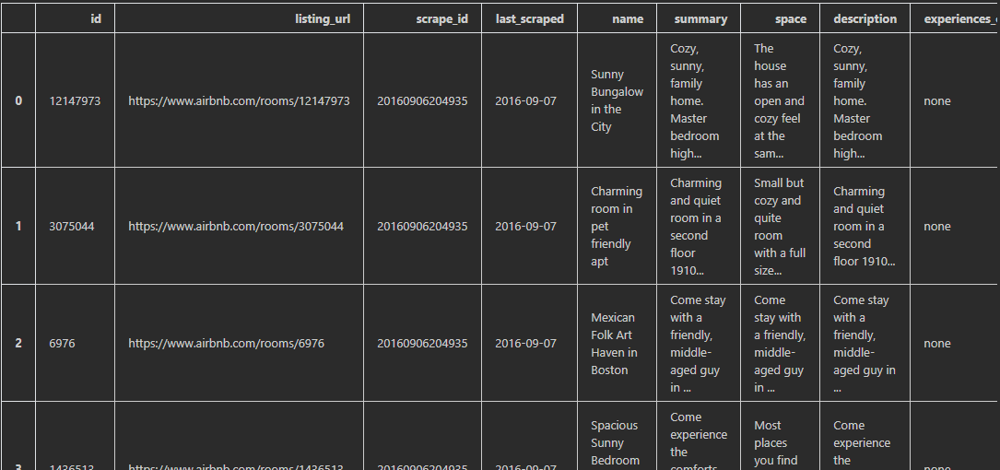
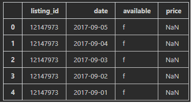
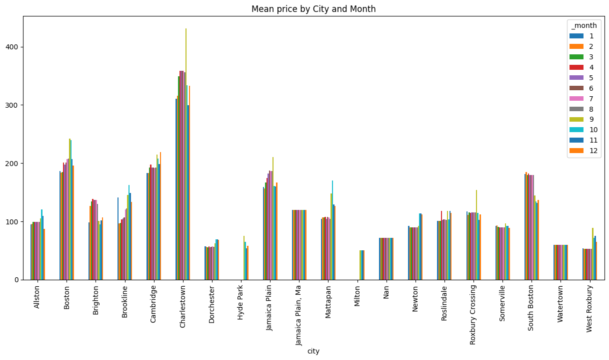
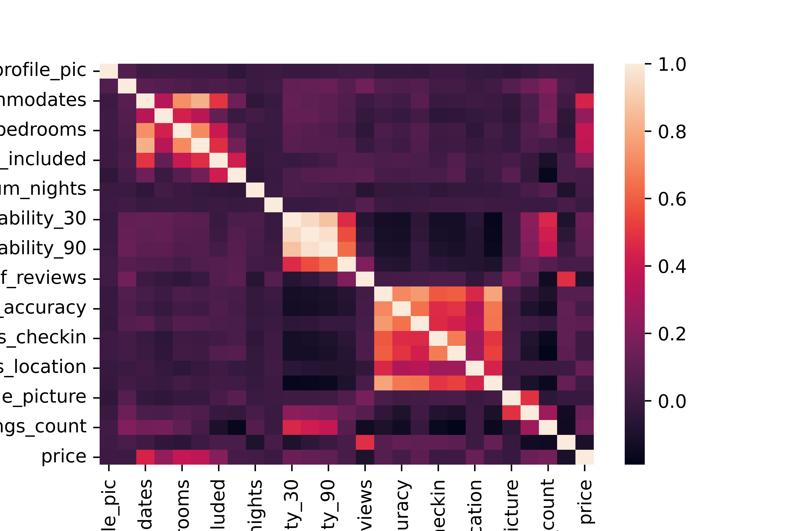

<div align="center">
  <h3 align="center">Boston Airbnb Open Data Analysis</h3>

  <p align="center">
    Self study for Boston Airbnb housing data.
    <br />
    <br />

  </p>
</div>

<!-- TABLE OF CONTENTS -->
<details>
  <summary>Table of Contents</summary>
  <ol>
    <li>
      <a href="#about-the-project">About The Project</a>
         <ul>
        <li><a href="#installation">Installation</a></li>
      </ul>
    </li>

   <li><a href="#prepare-data">Prepare data</a></li>

   <li><a href="#question-1">Question 1: Earning in timeframe and areas</a></li>
   <li><a href="#question-2">Question 2: Predict housing price by properties</a></li>

  </ol>
</details>


## About The Project

This is a small project in Udacity DataScience that I'm studing. Based on the project requirements I will study how to manipulate data and how to use AI model (LinearRegression) to know the data. The Boston Airbnb data I use is downloaded from [Boston data on Kaggle](https://www.kaggle.com/datasets/airbnb/boston)
All the sources can be referred at the source folder.

### Prerequisites
To analyze the data I will use Python and some common packages such as `pandas`, `numpy`.. I also use the `matplotlib` packages to visualize data and `sklearn.*` for prediction as well. These common packages can be downloaded by using the following command
```shell
pip install package-names # Let replace package-names with specified packages
```
Alternately we can create a new file `requirement.txt` including all required packages, then run the below command
```shell
pip install -r requirements.txt
```

## Prepare data
In the Boston data, there are some files:
* `calendar.csv`: Calendar, including listing id and the price and availability for that day
* `listing.csv`: Listings, including full descriptions and average review score
* `reviews.csv`: Reviews, including a unique id for each reviewer and detailed comments

We take alook about Boston data.




### Re-mapping city
In the listing data we can see the values cities have mixed values, so that we can re-mapping the values with
sames values, for example `Boston (Charlestown)`, `Jamaica Plain (Boston)`..These values should be mapped with specified location (if any)


| City                      | Count |
|---------------------------|-------|
| Boston                    | 3381  |
| Roxbury Crossing          | 24    |
| Somerville                | 19    |
| Jamaica Plain             | 18    |
| Brookline                 | 18    |
| Cambridge                 | 16    |
| Dorchester                | 15    |
| Brighton                  | 15    |
| Charlestown               | 15    |
| Allston                   | 12    |
| Roslindale                | 6     |
| West Roxbury              | 5     |
| ROXBURY CROSSING          | 4     |
| East Boston               | 3     |
| Mattapan                  | 3     |
| Boston, Massachusetts, US | 2     |
| South Boston              | 2     |
| Jamaica Plain             | 2     |
| Hyde Park                 | 2     |
| Jamaica Plain, Boston     | 2     |
| ALLSTON                   | 2     |
| Milton                    | 1     |
| South End, Boston         | 1     |
| dorchester, boston        | 1     |
| Jamaica Plain (Boston)    | 1     |
| Boston                    | 1     |
| boston                    | 1     |
| Boston (Charlestown)      | 1     |
| Mission Hill, Boston      | 1     |
| Jamaica Plain, MA         | 1     |
| Roslindale, Boston        | 1     |
| Boston (Jamaica Plain)    | 1     |
| Newton                    | 1     |
| Watertown                 | 1     |
| Jamaica plain             | 1     |
| east Boston               | 1     |
| 波士顿                    | 1     |
| Brighton                  | 1     |

```python
def convert_to_city(df, city_field):
    def re_mapping(city):
        _d = {
            "Boston (Charlestown)": "Charlestown",
            "Jamaica Plain (Boston)": "Jamaica Plain",
            "Jamaica Plain, Boston": "Jamaica Plain",
            "Jamaica plain": "Jamaica Plain",
            "Jamaica Plain, MA": "Jamaica Plain",
            "Boston (Jamaica Plain)": "Jamaica Plain",
            "Boston, Massachusetts, Us": "Boston",
            "East Boston": "Boston",
            "Dorchester, Boston": "Dorchester",
            "Roslindale, Boston": "Roslindale",
            "波士顿": "Boston",
            "South End, Boston": "Boston",
            "Mission Hill, Boston": "Boston"
        }

        return _d[title(city)] if title(city) in _d else title(city)

    df[city_field] = df[city_field].astype(str)
    df[city_field] = df[city_field].apply(trim)
    df[city_field] = df[city_field].apply(re_mapping)
```

### Merge data
The calendar data frame includes all information on the price by listing id and date, but we want to know which city
has a listing by month. We can merge the two data frames `df_listing` and `df_cal` to centralize data in a single data frame
Fortunately, we can use `pd.merge` of pandas to do that.
```python
pd.merge(_df_cal, _df_listing, how='inner', left_on=['listing_id'], right_on=['id'])
```

### Data convert
For other data such as date, and numeric... we can create customized functions to convert
`convert_to_date`, `convert_to_money`..:
- `convert_to_date`: this function will convert data column which default `dtypes` is `object` to `datetime` value
- `convert_to_money`: Because data has a $ sign as a currency unit, it is difficult to compare or sum by value, we will remove the $ sign and convert it to `float` type


## Question 1: Earning in timeframe and areas
In the merged data, we try to find how much prices in cities every month.
To do that we will extract `month` information from the data and visualize `mean price` by `city` and `month` dimensions.

The result as bellow:


We can see that:
- In the chart, we can see Charlestown city has the highest price (with a mean price 340$/day) and West Roxbury has the lowest price every month.
- Some cities are having a stable price in all months: Watertown, Milton
- Except for Boston (common location), some cities have a big difference in prices in day and month. Min price at Oct and Max price at Apr
    - Dorchester has a low price at 22$/day


## Question 2: Predict housing prices by properties
In the `listing` data we can try to guess `price` depending on the information (properties).
To do that I will:
- From the data, choose specified features (properties).
- Use `LinearRegression` model to fit with the data
- Monitor the` r2-score` to know how the trained model is good or not
- Add or remove features depending on `underfitting` or `overfitting` problems

### Choose specified features (properties):
Firstly we try to use specified features:
```python
def choose_features():
    # host_since: date
    return ['host_has_profile_pic', 'host_identity_verified', 'city', 'accommodates', 'bathrooms',
            'bedrooms', 'beds', 'bed_type', 'guests_included', 'extra_people', 'minimum_nights', 'maximum_nights',
            'availability_30', 'availability_60', 'availability_90', 'availability_365', 'number_of_reviews',
            'review_scores_rating', 'review_scores_accuracy', 'review_scores_cleanliness', 'review_scores_checkin',
            'review_scores_communication', 'review_scores_location', 'review_scores_value', 'cancellation_policy',
            'require_guest_profile_picture', 'require_guest_phone_verification', 'calculated_host_listings_count',
            'reviews_per_month', 'price']
```
These features was choose are numeric or can be categorized.

### Visualize by heatmap coefficients
We can see that some features mostly impact to price: `accommodates`, `bedrooms`, `guests_included`.
There are features that lowest impact to price: `number_of_reviews`, `calculated_host_listings_count`




### Run LinearRegression with the chosen features
We run `LinearRegression` and use `r2-score` to evaluate how linear regression fit the data with
chosen features. The result will be
```python
r2_score_train, r2_score_test = (0.24504695111503028, 0.2828570905639577)
```

It means that `r2-scores` are low for both training and test data. 
In the data, we have 3585 rows but only 27 columns corresponding to the chosen feature. So it's difficult to approximate a linear function to fit 3585 points in 27 dimensions. We got `underfitting` problems. So I will increase the number of chosen features by combining them.

### Try to include more features.
The number of training row will be 3585*0.9 (we split test size is 0.1), then we can increase the number of dimension should be around 3226


To do that we will:
- Expand columns such as `city`, `bed_type`, `cancellation_policy`. These columns are categories, we can 
represent to one-hot vector by using `pd.get_dummies`
- In each city, we will add more information like `mean`, `max`, `min` for numeric fields such as the number of bedrooms, numbers of availability in 30 days...
- Add more functions like log, square
- Add more features by combining 2 features

Now we have 3235 features and by running `LinearRegression` to fit trained data we get a perfect `r2-score`:
```python
r2_score_train, r2_score_test = (1.0, 0.9999999065964312)
```

That is great improvement :)
